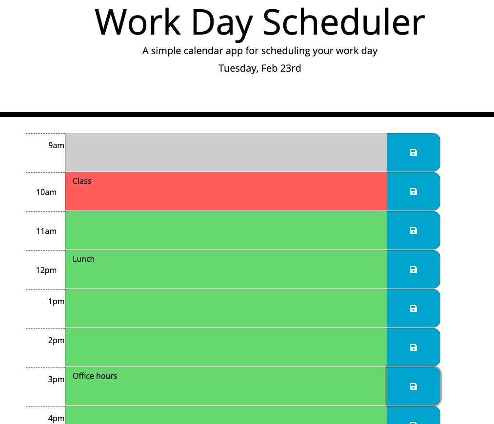

# Day Planner

## Description

This project is a sleek day planner application for all your scheduling needs. By pulling in the local time and date through moment.js, the app tracks the day by highlighting the current hour in a bold shade of red. Future time-blocks can be easily spotted with the bright green background, while gray tracks where you've been. To lock in your event, simply input a description in the given text area, and save with the button to the right.

## Requirements

GIVEN I am using a daily planner to create a schedule  
WHEN I open the planner  
THEN the current day is displayed at the top of the calendar  
WHEN I scroll down  
THEN I am presented with timeblocks for standard business hours  
WHEN I view the timeblocks for that day  
THEN each timeblock is color coded to indicate whether it is in the past, present, or future  
WHEN I click into a timeblock  
THEN I can enter an event  
WHEN I click the save button for that timeblock  
THEN the text for that event is saved in local storage  
WHEN I refresh the page  
THEN the saved events persist  

## Live Application

## Lessons Learned

This project provided challenges in developing my skills with both Jquery and utilizing dynamic tools such as moment.js. It also pushed me to grow in regards to streamlining functions, which is an area I have struggled with. Overall, I feel my code has cleaned up quite a bit over the course so far. 

### Link to deployed application

https://ihm57511.github.io/dayPlanner/
